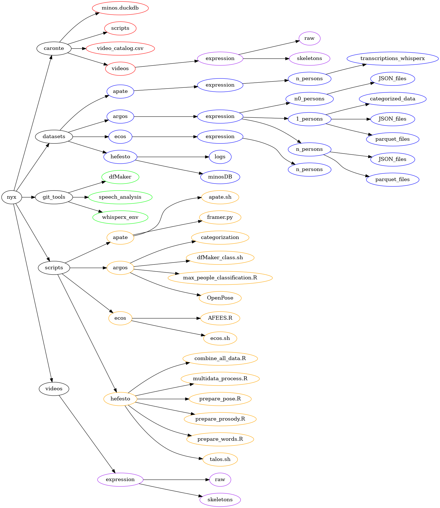

# multiNyx: Multimodal Dataset Generator

**multiNyx** is an open-source tool developed as part of the **Modeling the Multimodal Flow of Human Communication: Language, Gesture, and Prosody (MULTIFLOW)** project. The tool is designed to generate multimodal datasets for research in communication, linguistics, and the humanities. 

multiNyx integrates various tools, including OpenPose for human pose estimation, PRAAT for prosody analysis, and Whisper for speech transcription and text analysis, enabling the automated creation of datasets that combine multiple forms of data. 

- [Project Structure](#project-structure)
- [About the MULTIFLOW Project](#about-the-multiflow-project)
- [Repository Organization](#repository-organization)
- [Documentation](#documentation)
- [License](#license)

## Project Structure

Below is the current structure of the multiNyx project, which organizes the various components necessary for integrating and processing multimodal data.

## About the MULTIFLOW Project

multiNyx is developed under the **MULTIFLOW** project, directed by [CrisDedalo](https://github.com/CrisDedalo). MULTIFLOW aims to model the multimodal flow of human communication, encompassing language, gesture, and prosody. For more information about the project, please visit the [MULTIFLOW project page](https://daedalus.um.es/?page_id=32).

## Repository Organization

- **/argos**: Vision processing, primarily focused on human pose estimation.
- **/ecos**: Prosody analysis, handling aspects like intonation, stress, and rhythm in speech.
- **/apate**: Text processing, including speech transcription and text analysis.
- **/hefesto**: Tools for building and combining multisets of data from the different modalities.
- **/videos**: Audiovisual format files (e.g., `.mp4`) used as input or generated by the system.

## Documentation

For detailed documentation on how to use and contribute to multiNyx, please refer to the [multiNyx Wiki](https://github.com/daedalusLAB/multiNyx/wiki).

## License

multiNyx is licensed under the GPL-3.0 License. The project plans to transition to the European Union Public Licence (EUPL) as all legal and technical requirements are understood and fulfilled. See the [LICENSE](LICENSE) file for more details.
